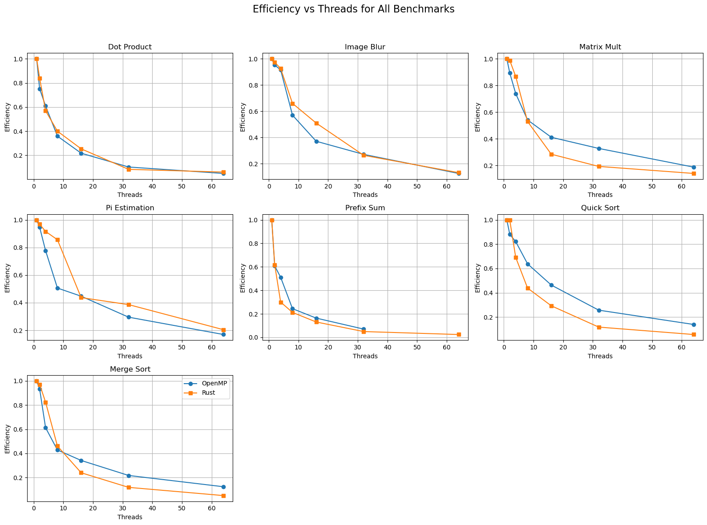

```python
import pandas as pd
import matplotlib.pyplot as plt
import seaborn as sns
import os
import numpy as np
from scipy.optimize import curve_fit
```

## 1. Load Benchmark Data
- Read all `results/*.csv` files into `pandas` DataFrames


```python
!ls "./results"
```

    dot_product.csv   matrix_mult.csv   pi_estimation.csv quick_sort.csv
    image_blur.csv    merge_sort.csv    prefix_sum.csv


```python
# Define both result paths
openmp_path = "./results"
rust_path = "./rust_proj/results"

# Define benchmark base names
benchmark_names = [
    "dot_product", "image_blur", "matrix_mult", "pi_estimation",
    "prefix_sum", "quick_sort", "merge_sort"
]

# Load all OpenMP results
openmp_results = {}
for name in benchmark_names:
    filepath = os.path.join(openmp_path, f"{name}.csv")
    df = pd.read_csv(filepath)
    
    # Convert 'Time' or 'Time (s)' column to milliseconds
    for col in df.columns:
        if "Time" in col and "(s)" in col:
            df[col] = df[col] * 1000
            df.rename(columns={col: col.replace("(s)", "(ms)")}, inplace=True)

    openmp_results[name] = df

# Load all Rust results
rust_results = {}
for name in benchmark_names:
    filepath = os.path.join(rust_path, f"{name}_rust.csv")
    rust_results[name] = pd.read_csv(filepath)
```


```python
# Loop through each benchmark's Rust result
for name, df in rust_results.items():
    time_col = next((col for col in df.columns if "Time" in col), None)
    if time_col:
        new_times = []
        for val in df[time_col]:
            if val < 10:  # heuristic: if very low, probably in seconds
                new_times.append(val * 1000)  # convert to ms
            else:
                new_times.append(val)  # already in ms
        df[time_col] = new_times
        df.rename(columns={time_col: "Time (ms)"}, inplace=True)
```


```python
for name in benchmark_names:
    print(name)
    print(openmp_results[name].head())
    print(rust_results[name].head())
    print("")
```

    dot_product
       Threads  Time (ms)  Dot Product
    0        1    378.277   16777216.0
    1        2    251.706   20969164.0
    2        4    155.207   23631394.0
    3        8    131.793   24579896.0
    4       16    108.708   24874172.0
       Threads   Time (ms)     Result
    0        1  375.557047  100000000
    1        2  223.732525  100000000
    2        4  164.880838  100000000
    3        8  117.367505  100000000
    4       16   92.594435  100000000
    
    image_blur
       Threads  Time (ms) Correctness
    0        1   1152.866     Correct
    1        2    605.302     Correct
    2        4    314.942     Correct
    3        8    252.947     Correct
    4       16    194.328     Correct
       Threads    Time (ms)  Result
    0        1  2954.227000     NaN
    1        2  1517.958000     NaN
    2        4   797.550888     NaN
    3        8   559.759823     NaN
    4       16   362.453798     NaN
    
    matrix_mult
       Threads  Time (ms)
    0        1   4136.051
    1        2   2314.669
    2        4   1398.697
    3        8    954.454
    4       16    627.427
       Threads  Time (ms)  Result
    0        1   2783.196     NaN
    1        2   1409.073     NaN
    2        4    801.658     NaN
    3        8    656.411     NaN
    4       16    610.427     NaN
    
    pi_estimation
       Threads  Time (ms)  Pi Estimate
    0        1   3067.497     3.141532
    1        2   1619.837     3.141716
    2        4    986.242     3.141978
    3        8    757.476     3.141559
    4       16    428.682     3.141582
       Threads  Time (ms)    Result
    0        1   5452.323  3.141547
    1        2   2814.818  3.141408
    2        4   1487.510  3.141488
    3        8    796.173  3.141615
    4       16    779.768  3.141692
    
    prefix_sum
       Threads  Time (ms)
    0        1    538.079
    1        2    442.912
    2        4    262.932
    3        8    275.661
    4       16    205.359
       Threads   Time (ms)  Result
    0        1  390.307368     NaN
    1        2  316.032158     NaN
    2        4  324.974458     NaN
    3        8  229.853436     NaN
    4       16  186.717630     NaN
    
    quick_sort
       Threads  Time (ms)
    0        1  46079.157
    1        2  26167.981
    2        4  14028.923
    3        8   9024.287
    4       16   6209.166
       Threads    Time (ms)  Result
    0        1  1516.172329     NaN
    1        2   760.064705     NaN
    2        4   548.356448     NaN
    3        8   431.691968     NaN
    4       16   323.153829     NaN
    
    merge_sort
       Threads  Time (ms)
    0        1  41677.730
    1        2  22322.493
    2        4  16996.031
    3        8  12161.643
    4       16   7624.287
       Threads     Time (ms)  Result
    0        1  32546.224387     NaN
    1        2  16754.028611     NaN
    2        4   9867.187427     NaN
    3        8   8826.372828     NaN
    4       16   8480.628826     NaN
    


## 2. Plot Raw Times
- Time vs Threads plots per benchmark
- Bar chart of Best Time per language


```python
# --- Subplots for Time vs Threads ---
num_benchmarks = len(benchmark_names)
# 3 rows x 3 columns grid
fig, axes = plt.subplots(nrows=3, ncols=3, figsize=(10, 8), sharey=False)
axes = axes.flatten()

for i, name in enumerate(benchmark_names):
    if name in openmp_results and name in rust_results:
        df_openmp = openmp_results[name]
        df_rust = rust_results[name]

        omp_x = df_openmp.iloc[:, 0]
        omp_y = df_openmp.iloc[:, 1]
        rust_x = df_rust.iloc[:, 0]
        rust_y = df_rust.iloc[:, 1]

        ax = axes[i]
        ax.plot(omp_x, omp_y, marker='o', label='OpenMP', linewidth=2)
        ax.plot(rust_x, rust_y, marker='s', label='Rust', linewidth=2)
        ax.set_title(name.replace("_", " ").title(), fontsize=10)
        ax.set_xlabel('Threads')
        ax.tick_params(axis='x', rotation=45)
        ax.grid(True)
        if i == 0:
            ax.set_ylabel('Time (s or ms)')
        if i == len(benchmark_names) - 1:
            ax.legend(loc='upper right', fontsize=8)

plt.suptitle("Execution Time vs Threads for All Benchmarks", fontsize=14)
plt.tight_layout(rect=[0, 0, 1, 0.93])
plt.show()
```


    

    


```python
# --- Bar chart of best times ---
best_times = {
    "Benchmark": [],
    "OpenMP": [],
    "Rust": []
}

for name in benchmark_names:
    if name in openmp_results and name in rust_results:
        best_times["Benchmark"].append(name)
        best_times["OpenMP"].append(min(openmp_results[name].iloc[:, 1]))
        best_times["Rust"].append(min(rust_results[name].iloc[:, 1]))

df_best = pd.DataFrame(best_times)

# Bar chart
df_best.set_index("Benchmark").plot(kind='bar', figsize=(10, 6))
plt.ylabel("Best Time (s or ms)")
plt.title("Best Execution Time per Language")
plt.xticks(rotation=45)
plt.grid(axis='y')
plt.tight_layout()
plt.show()
```


    

    


## 3. Compute Speedup
- Add new columns for speedup
- Plot speedup vs threads


```python
# Add speedup and efficiency columns
for name in benchmark_names:
    if name in openmp_results and name in rust_results:
        # OpenMP
        omp_df = openmp_results[name].copy()
        omp_baseline = omp_df.iloc[0, 1]  # 1-thread time
        omp_df["Speedup"] = omp_baseline / omp_df.iloc[:, 1]
        omp_df["Efficiency"] = omp_df["Speedup"] / omp_df["Threads"]
        openmp_results[name] = omp_df

        # Rust
        rust_df = rust_results[name].copy()
        rust_baseline = rust_df.iloc[0, 1]
        rust_df["Speedup"] = rust_baseline / rust_df.iloc[:, 1]
        rust_df["Efficiency"] = rust_df["Speedup"] / rust_df["Threads"]
        rust_results[name] = rust_df
```


```python
fig, axes = plt.subplots(3, 3, figsize=(15, 10))
axes = axes.flatten()

for i, name in enumerate(benchmark_names):
    if name in openmp_results and name in rust_results:
        omp_df = openmp_results[name]
        rust_df = rust_results[name]

        axes[i].plot(omp_df["Threads"], omp_df["Speedup"], label="OpenMP", marker="o")
        axes[i].plot(rust_df["Threads"], rust_df["Speedup"], label="Rust", marker="s")
        axes[i].set_title(name.replace("_", " ").title())
        axes[i].set_xlabel("Threads")
        axes[i].set_ylabel("Speedup")
        axes[i].grid(True)

# Hide extra subplot if < 9 benchmarks
for j in range(len(benchmark_names), 9):
    fig.delaxes(axes[j])

axes[0].legend()
fig.suptitle("Speedup vs Threads for All Benchmarks", fontsize=14)
plt.tight_layout()
plt.show()

```


    

    


## 4. Curve Fit & Scalability
- Fit T(1)/T(p) to Amdahl’s Law curve
- goodness-of-fit score


```python
# Define Amdahl's Law for speedup
def amdahl_speedup(p, alpha):
    return 1 / (alpha + (1 - alpha) / p)

# Fit and plot Amdahl's Law for both OpenMP and Rust speedups
fig, axs = plt.subplots(3, 3, figsize=(15, 10))
axs = axs.flatten()

for idx, name in enumerate(benchmark_names):
    if name not in openmp_results or name not in rust_results:
        continue

    omp_df = openmp_results[name]
    rust_df = rust_results[name]

    # Threads and time
    omp_threads, omp_time = omp_df.iloc[:, 0].values, omp_df.iloc[:, 1].values
    rust_threads, rust_time = rust_df.iloc[:, 0].values, rust_df.iloc[:, 1].values

    # Normalize to 1-thread time to compute speedup
    omp_speedup = omp_time[0] / omp_time
    rust_speedup = rust_time[0] / rust_time

    # Fit Amdahl's law
    omp_alpha, _ = curve_fit(amdahl_speedup, omp_threads, omp_speedup, bounds=(0, 1))
    rust_alpha, _ = curve_fit(amdahl_speedup, rust_threads, rust_speedup, bounds=(0, 1))

    # Generate fitted curves
    omp_fit = amdahl_speedup(omp_threads, omp_alpha[0])
    rust_fit = amdahl_speedup(rust_threads, rust_alpha[0])

    ax = axs[idx]
    ax.plot(rust_threads, rust_speedup, label="Rust Actual", color="green")
    ax.plot(rust_threads, rust_fit, linestyle="--", label="Rust Fit", color="blue", alpha=0.6)

    ax.plot(omp_threads, omp_speedup, label="OpenMP Actual", color="gray")
    ax.plot(omp_threads, omp_fit, linestyle="--", label="OpenMP Fit", color="purple", alpha=0.6)

    ax.set_title(name.replace("_", " ").title())
    ax.set_xlabel("Threads")
    ax.set_ylabel("Speedup")
    ax.grid(True)

axs[0].legend()
plt.suptitle("Speedup Curve Fit using Amdahl's Law", fontsize=14)
plt.tight_layout()
plt.subplots_adjust(top=0.92)
plt.show()
```


    

    


```python
# Compute Scalability Score (max speedup / threads at max)
scalability_scores = {
    "Benchmark": [],
    "OpenMP": [],
    "Rust": []
}

for name in benchmark_names:
    if name in openmp_results and name in rust_results:
        omp_df = openmp_results[name]
        rust_df = rust_results[name]

        # OpenMP score
        omp_max_idx = omp_df["Speedup"].idxmax()
        omp_max_speedup = omp_df.loc[omp_max_idx, "Speedup"]
        omp_threads_at_max = omp_df.loc[omp_max_idx, "Threads"]
        omp_score = omp_max_speedup / omp_threads_at_max

        # Rust score
        rust_max_idx = rust_df["Speedup"].idxmax()
        rust_max_speedup = rust_df.loc[rust_max_idx, "Speedup"]
        rust_threads_at_max = rust_df.loc[rust_max_idx, "Threads"]
        rust_score = rust_max_speedup / rust_threads_at_max

        # Save to results
        scalability_scores["Benchmark"].append(name)
        scalability_scores["OpenMP"].append(omp_score)
        scalability_scores["Rust"].append(rust_score)

# Turn into DataFrame for easy display or plotting
df_scalability = pd.DataFrame(scalability_scores)
display(df_scalability)

```


<div>
<style scoped>
    .dataframe tbody tr th:only-of-type {
        vertical-align: middle;
    }

    .dataframe tbody tr th {
        vertical-align: top;
    }

    .dataframe thead th {
        text-align: right;
    }
</style>
<table border="1" class="dataframe">
  <thead>
    <tr style="text-align: right;">
      <th></th>
      <th>Benchmark</th>
      <th>OpenMP</th>
      <th>Rust</th>
    </tr>
  </thead>
  <tbody>
    <tr>
      <th>0</th>
      <td>dot_product</td>
      <td>0.217485</td>
      <td>0.253496</td>
    </tr>
    <tr>
      <th>1</th>
      <td>image_blur</td>
      <td>0.270764</td>
      <td>0.263605</td>
    </tr>
    <tr>
      <th>2</th>
      <td>matrix_mult</td>
      <td>0.188306</td>
      <td>0.140929</td>
    </tr>
    <tr>
      <th>3</th>
      <td>pi_estimation</td>
      <td>0.169799</td>
      <td>0.204593</td>
    </tr>
    <tr>
      <th>4</th>
      <td>prefix_sum</td>
      <td>0.163762</td>
      <td>0.130648</td>
    </tr>
    <tr>
      <th>5</th>
      <td>quick_sort</td>
      <td>0.139820</td>
      <td>0.293237</td>
    </tr>
    <tr>
      <th>6</th>
      <td>merge_sort</td>
      <td>0.124037</td>
      <td>0.239857</td>
    </tr>
  </tbody>
</table>
</div>


## 5. Efficiency
- Add efficiency column to each DataFrame (both OpenMP and Rust).
- Plot Efficiency vs Threads for each benchmark.


```python
# Add Efficiency columns
for name in benchmark_names:
    if name in openmp_results and name in rust_results:
        df_openmp = openmp_results[name]
        df_rust = rust_results[name]

        df_openmp['Efficiency'] = df_openmp['Speedup'] / df_openmp['Threads']
        df_rust['Efficiency'] = df_rust['Speedup'] / df_rust['Threads']
```


```python
# Plot Efficiency vs Threads (3x3 layout)
fig, axes = plt.subplots(nrows=3, ncols=3, figsize=(16, 12))
axes = axes.flatten()

for idx, name in enumerate(benchmark_names):
    if name in openmp_results and name in rust_results:
        df_openmp = openmp_results[name]
        df_rust = rust_results[name]

        ax = axes[idx]
        ax.plot(df_openmp['Threads'], df_openmp['Efficiency'], marker='o', label='OpenMP')
        ax.plot(df_rust['Threads'], df_rust['Efficiency'], marker='s', label='Rust')
        ax.set_title(name.replace("_", " ").title())
        ax.set_xlabel("Threads")
        ax.set_ylabel("Efficiency")
        ax.grid(True)
        if name == "merge_sort":
            ax.legend()

# Remove empty subplots
for i in range(len(benchmark_names), len(axes)):
    fig.delaxes(axes[i])

fig.suptitle("Efficiency vs Threads for All Benchmarks", fontsize=16)
plt.tight_layout(rect=[0, 0, 1, 0.95])
plt.show()
```


    

    


## 6. Rust vs OpenMP Win Count
- for each benchmark, whether Rust or OpenMP had the better best-case time


```python
# Win count tracking
win_counts = {
    "Benchmark": [],
    "Winner": []
}

for name in benchmark_names:
    if name in openmp_results and name in rust_results:
        omp_best = openmp_results[name]["Time (ms)"].min()
        rust_best = rust_results[name]["Time (ms)"].min()
        
        winner = "Rust" if rust_best < omp_best else "OpenMP"
        win_counts["Benchmark"].append(name)
        win_counts["Winner"].append(winner)

df_wins = pd.DataFrame(win_counts)

# Tally wins
win_summary = df_wins["Winner"].value_counts().to_frame(name="Count")
display(df_wins)
display(win_summary)
```


<div>
<style scoped>
    .dataframe tbody tr th:only-of-type {
        vertical-align: middle;
    }

    .dataframe tbody tr th {
        vertical-align: top;
    }

    .dataframe thead th {
        text-align: right;
    }
</style>
<table border="1" class="dataframe">
  <thead>
    <tr style="text-align: right;">
      <th></th>
      <th>Benchmark</th>
      <th>Winner</th>
    </tr>
  </thead>
  <tbody>
    <tr>
      <th>0</th>
      <td>dot_product</td>
      <td>Rust</td>
    </tr>
    <tr>
      <th>1</th>
      <td>image_blur</td>
      <td>OpenMP</td>
    </tr>
    <tr>
      <th>2</th>
      <td>matrix_mult</td>
      <td>Rust</td>
    </tr>
    <tr>
      <th>3</th>
      <td>pi_estimation</td>
      <td>OpenMP</td>
    </tr>
    <tr>
      <th>4</th>
      <td>prefix_sum</td>
      <td>Rust</td>
    </tr>
    <tr>
      <th>5</th>
      <td>quick_sort</td>
      <td>Rust</td>
    </tr>
    <tr>
      <th>6</th>
      <td>merge_sort</td>
      <td>OpenMP</td>
    </tr>
  </tbody>
</table>
</div>


<div>
<style scoped>
    .dataframe tbody tr th:only-of-type {
        vertical-align: middle;
    }

    .dataframe tbody tr th {
        vertical-align: top;
    }

    .dataframe thead th {
        text-align: right;
    }
</style>
<table border="1" class="dataframe">
  <thead>
    <tr style="text-align: right;">
      <th></th>
      <th>Count</th>
    </tr>
    <tr>
      <th>Winner</th>
      <th></th>
    </tr>
  </thead>
  <tbody>
    <tr>
      <th>Rust</th>
      <td>4</td>
    </tr>
    <tr>
      <th>OpenMP</th>
      <td>3</td>
    </tr>
  </tbody>
</table>
</div>


```python
thread_wins = []

for name in benchmark_names:
    if name in openmp_results and name in rust_results:
        omp_df = openmp_results[name]
        rust_df = rust_results[name]

        for t_omp, t_rust, threads in zip(omp_df.iloc[:, 1], rust_df.iloc[:, 1], omp_df["Threads"]):
            if t_omp < t_rust:
                winner = "OpenMP"
            elif t_rust < t_omp:
                winner = "Rust"
            else:
                winner = "Tie"
            thread_wins.append({"Benchmark": name, "Threads": threads, "Winner": winner})

# Convert to DataFrame
df_thread_wins = pd.DataFrame(thread_wins)

# Count wins per language
thread_win_count = df_thread_wins["Winner"].value_counts().reset_index()
thread_win_count.columns = ["Winner", "Count"]
display(df_thread_wins)
display(thread_win_count)
```


<div>
<style scoped>
    .dataframe tbody tr th:only-of-type {
        vertical-align: middle;
    }

    .dataframe tbody tr th {
        vertical-align: top;
    }

    .dataframe thead th {
        text-align: right;
    }
</style>
<table border="1" class="dataframe">
  <thead>
    <tr style="text-align: right;">
      <th></th>
      <th>Benchmark</th>
      <th>Threads</th>
      <th>Winner</th>
    </tr>
  </thead>
  <tbody>
    <tr>
      <th>0</th>
      <td>dot_product</td>
      <td>1</td>
      <td>Rust</td>
    </tr>
    <tr>
      <th>1</th>
      <td>dot_product</td>
      <td>2</td>
      <td>Rust</td>
    </tr>
    <tr>
      <th>2</th>
      <td>dot_product</td>
      <td>4</td>
      <td>OpenMP</td>
    </tr>
    <tr>
      <th>3</th>
      <td>dot_product</td>
      <td>8</td>
      <td>Rust</td>
    </tr>
    <tr>
      <th>4</th>
      <td>dot_product</td>
      <td>16</td>
      <td>Rust</td>
    </tr>
    <tr>
      <th>5</th>
      <td>dot_product</td>
      <td>32</td>
      <td>OpenMP</td>
    </tr>
    <tr>
      <th>6</th>
      <td>dot_product</td>
      <td>64</td>
      <td>Rust</td>
    </tr>
    <tr>
      <th>7</th>
      <td>image_blur</td>
      <td>1</td>
      <td>OpenMP</td>
    </tr>
    <tr>
      <th>8</th>
      <td>image_blur</td>
      <td>2</td>
      <td>OpenMP</td>
    </tr>
    <tr>
      <th>9</th>
      <td>image_blur</td>
      <td>4</td>
      <td>OpenMP</td>
    </tr>
    <tr>
      <th>10</th>
      <td>image_blur</td>
      <td>8</td>
      <td>OpenMP</td>
    </tr>
    <tr>
      <th>11</th>
      <td>image_blur</td>
      <td>16</td>
      <td>OpenMP</td>
    </tr>
    <tr>
      <th>12</th>
      <td>image_blur</td>
      <td>32</td>
      <td>OpenMP</td>
    </tr>
    <tr>
      <th>13</th>
      <td>image_blur</td>
      <td>64</td>
      <td>OpenMP</td>
    </tr>
    <tr>
      <th>14</th>
      <td>matrix_mult</td>
      <td>1</td>
      <td>Rust</td>
    </tr>
    <tr>
      <th>15</th>
      <td>matrix_mult</td>
      <td>2</td>
      <td>Rust</td>
    </tr>
    <tr>
      <th>16</th>
      <td>matrix_mult</td>
      <td>4</td>
      <td>Rust</td>
    </tr>
    <tr>
      <th>17</th>
      <td>matrix_mult</td>
      <td>8</td>
      <td>Rust</td>
    </tr>
    <tr>
      <th>18</th>
      <td>matrix_mult</td>
      <td>16</td>
      <td>Rust</td>
    </tr>
    <tr>
      <th>19</th>
      <td>matrix_mult</td>
      <td>32</td>
      <td>OpenMP</td>
    </tr>
    <tr>
      <th>20</th>
      <td>matrix_mult</td>
      <td>64</td>
      <td>Rust</td>
    </tr>
    <tr>
      <th>21</th>
      <td>pi_estimation</td>
      <td>1</td>
      <td>OpenMP</td>
    </tr>
    <tr>
      <th>22</th>
      <td>pi_estimation</td>
      <td>2</td>
      <td>OpenMP</td>
    </tr>
    <tr>
      <th>23</th>
      <td>pi_estimation</td>
      <td>4</td>
      <td>OpenMP</td>
    </tr>
    <tr>
      <th>24</th>
      <td>pi_estimation</td>
      <td>8</td>
      <td>OpenMP</td>
    </tr>
    <tr>
      <th>25</th>
      <td>pi_estimation</td>
      <td>16</td>
      <td>OpenMP</td>
    </tr>
    <tr>
      <th>26</th>
      <td>pi_estimation</td>
      <td>32</td>
      <td>OpenMP</td>
    </tr>
    <tr>
      <th>27</th>
      <td>pi_estimation</td>
      <td>64</td>
      <td>OpenMP</td>
    </tr>
    <tr>
      <th>28</th>
      <td>prefix_sum</td>
      <td>1</td>
      <td>Rust</td>
    </tr>
    <tr>
      <th>29</th>
      <td>prefix_sum</td>
      <td>2</td>
      <td>Rust</td>
    </tr>
    <tr>
      <th>30</th>
      <td>prefix_sum</td>
      <td>4</td>
      <td>OpenMP</td>
    </tr>
    <tr>
      <th>31</th>
      <td>prefix_sum</td>
      <td>8</td>
      <td>Rust</td>
    </tr>
    <tr>
      <th>32</th>
      <td>prefix_sum</td>
      <td>16</td>
      <td>Rust</td>
    </tr>
    <tr>
      <th>33</th>
      <td>prefix_sum</td>
      <td>32</td>
      <td>OpenMP</td>
    </tr>
    <tr>
      <th>34</th>
      <td>quick_sort</td>
      <td>1</td>
      <td>Rust</td>
    </tr>
    <tr>
      <th>35</th>
      <td>quick_sort</td>
      <td>2</td>
      <td>Rust</td>
    </tr>
    <tr>
      <th>36</th>
      <td>quick_sort</td>
      <td>4</td>
      <td>Rust</td>
    </tr>
    <tr>
      <th>37</th>
      <td>quick_sort</td>
      <td>8</td>
      <td>Rust</td>
    </tr>
    <tr>
      <th>38</th>
      <td>quick_sort</td>
      <td>16</td>
      <td>Rust</td>
    </tr>
    <tr>
      <th>39</th>
      <td>quick_sort</td>
      <td>32</td>
      <td>Rust</td>
    </tr>
    <tr>
      <th>40</th>
      <td>quick_sort</td>
      <td>64</td>
      <td>Rust</td>
    </tr>
    <tr>
      <th>41</th>
      <td>merge_sort</td>
      <td>1</td>
      <td>Rust</td>
    </tr>
    <tr>
      <th>42</th>
      <td>merge_sort</td>
      <td>2</td>
      <td>Rust</td>
    </tr>
    <tr>
      <th>43</th>
      <td>merge_sort</td>
      <td>4</td>
      <td>Rust</td>
    </tr>
    <tr>
      <th>44</th>
      <td>merge_sort</td>
      <td>8</td>
      <td>Rust</td>
    </tr>
    <tr>
      <th>45</th>
      <td>merge_sort</td>
      <td>16</td>
      <td>OpenMP</td>
    </tr>
    <tr>
      <th>46</th>
      <td>merge_sort</td>
      <td>32</td>
      <td>OpenMP</td>
    </tr>
    <tr>
      <th>47</th>
      <td>merge_sort</td>
      <td>64</td>
      <td>OpenMP</td>
    </tr>
  </tbody>
</table>
</div>


<div>
<style scoped>
    .dataframe tbody tr th:only-of-type {
        vertical-align: middle;
    }

    .dataframe tbody tr th {
        vertical-align: top;
    }

    .dataframe thead th {
        text-align: right;
    }
</style>
<table border="1" class="dataframe">
  <thead>
    <tr style="text-align: right;">
      <th></th>
      <th>Winner</th>
      <th>Count</th>
    </tr>
  </thead>
  <tbody>
    <tr>
      <th>0</th>
      <td>Rust</td>
      <td>26</td>
    </tr>
    <tr>
      <th>1</th>
      <td>OpenMP</td>
      <td>22</td>
    </tr>
  </tbody>
</table>
</div>

